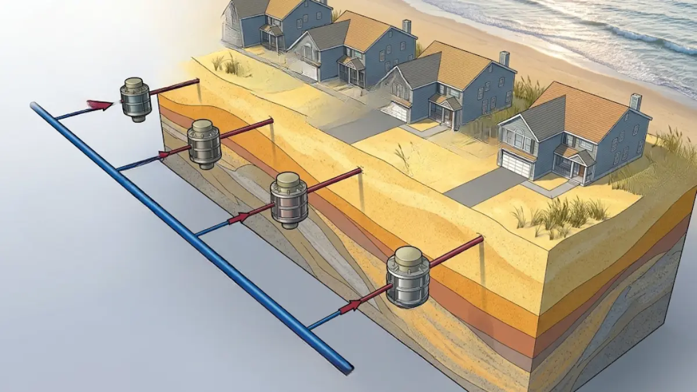
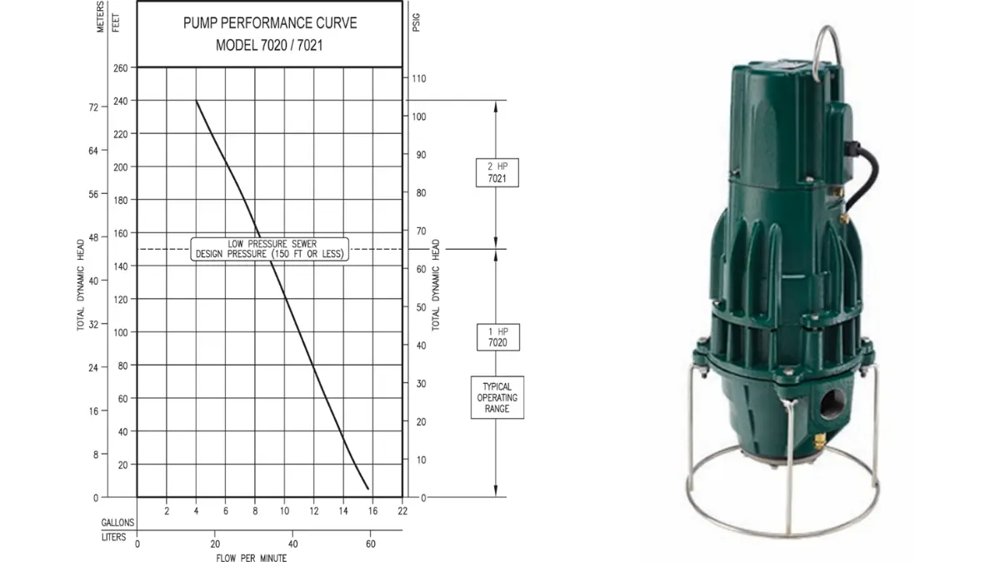
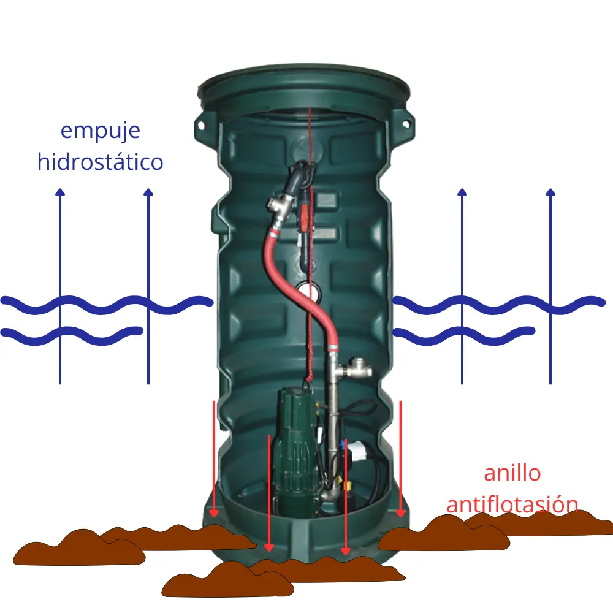
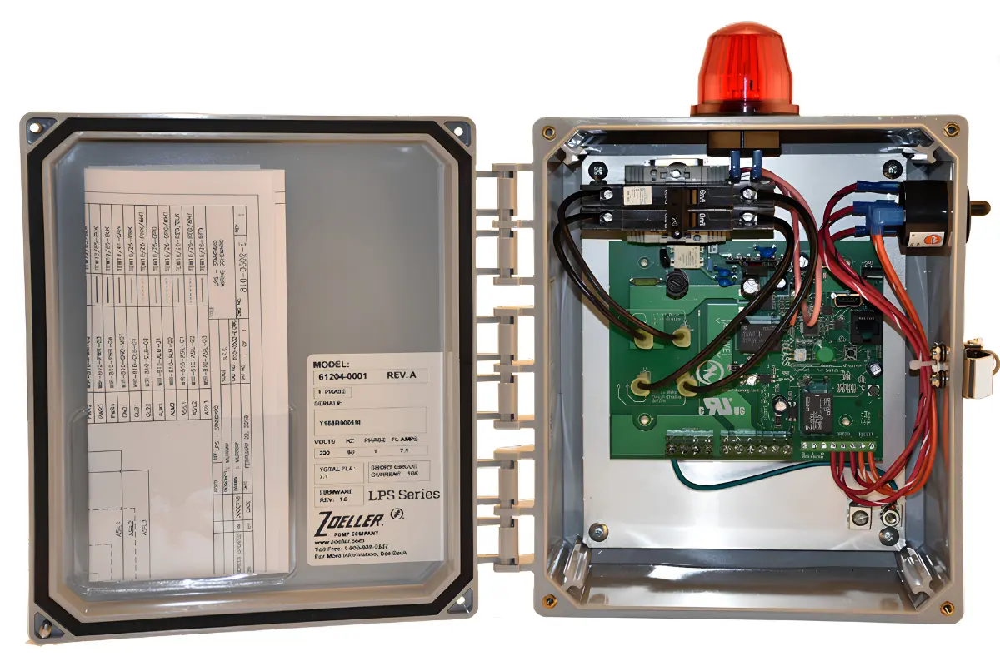

# Análisis de Contrapresión y Curvas Hidráulicas Pronunciadas

El desarrollo de infraestructura de conducción de aguas residuales en las regiones costeras o zonas con acuíferos someros en México plantea uno de los desafíos de ingeniería civil más complejos y costosos del sector. La instalación tradicional de colectores por gravedad bajo estas condiciones geotécnicas específicas exige excavaciones profundas que interceptan de forma inmediata el flujo subterráneo, demandando sistemas continuos de abatimiento del nivel freático, entibados estructurales severos y un riesgo latente de asentamientos mecánicos en las edificaciones colindantes. Frente a este escenario de alta vulnerabilidad operativa, el diseño de sistemas de alcantarillado a presión (LPS) se consolida como la única alternativa metodológica capaz de garantizar la mitigación de riesgos, la viabilidad financiera y la estabilidad estructural del activo a largo plazo, promoviendo sistemas hidrodinámicos diseñados para trabajar de manera ininterrumpida durante quince o veinte años sin experimentar colapsos mecánicos ni degradaciones estructurales.

La transición hacia una red presurizada introduce variables hidrodinámicas críticas que difieren drásticamente de los canales abiertos tradicionales. En un sistema de **diseño de alcantarillado a presion en niveles freaticos altos**, decenas o cientos de estaciones de bombeo periféricas simplex o dúplex descargan de manera simultánea e intermitente en una red troncal común de diámetro reducido. Este comportamiento operativo genera un entorno dinámico de contrapresiones fluctuantes dentro de las líneas de impulsión, donde cada nodo debe poseer la capacidad física de vencer la resistencia hidráulica variable de la red sin experimentar el fenómeno de bloqueo hidráulico o "shut-off", un análisis que la ingeniería consultiva especializada de Zoeller mediante su distribuidor Soluciones Integrales en Bombeo Inteligente SIBI aborda priorizando el Costo Total de Propiedad (TCO).

## Comportamiento Dinámico de Circuitos Interconectados y Pérdidas por Fricción

El error de diseño más común al migrar hacia la tecnología LPS es dimensionar la planta de bombeo utilizando métodos estáticos convencionales. En una red presurizada real, la Carga Dinámica Total (CDT) que debe superar cada bomba trituradora no es un valor fijo; constituye una función matemática compleja supeditada al número de equipos que operan simultáneamente en ese instante específico dentro del circuito.

Para calcular con rigor la CDT en una red interconectada, la ingeniería consultiva debe emplear ecuaciones de fricción hidrodinámica de validez internacional estipuladas bajo normativas como la ISO o estándares hidráulicos avanzados, modelando el peor escenario operativo previsible: la coincidencia máxima de arranque en las horas de mayor aporte. Las pérdidas de carga por fricción ($h_f$) se elevan exponencialmente conforme el caudal total inyectado en la troncal reduce el área efectiva de flujo, incrementando la velocidad del fluido y generando una contrapresión que actúa directamente sobre las descargas de los cárcamos aguas arriba. El cálculo de la carga dinámica total se rige formalmente bajo la ecuación general:

$$\text{CDT} = Z_{\text{estática}} + h_f + h_m$$

Donde $Z_{\text{estática}}$ representa la elevación geométrica neta, $h_f$ las pérdidas por fricción calculadas mediante Darcy-Weisbach y $h_m$ las pérdidas menores por accesorios locales.

## Criterios de Selección: La Necesidad de Curvas Inclinadas Pronunciadas

Para contrarrestar estas fluctuaciones de presión sin inducir fallas mecánicas ni sobrecalentamiento, los sistemas LPS de CurrentCommand rechazan el uso de bombas centrífugas estándar de curva plana que comercializan distribuidores masivos. Si se instala una bomba de curva plana en una red presurizada, cualquier incremento imprevisto en la contrapresión de la troncal provocará un desplazamiento drástico hacia la izquierda en su punto de operación, reduciendo severamente el caudal entregado o anulándolo por completo al alcanzar su presión de cierre. Una bomba operando de manera continua a válvula cerrada disipa toda su energía cinética en forma de calor, evaporando el fluido interno, destruyendo los sellos mecánicos y quemando los devanados del motor.

Por el contrario, la adopción de una **bomba trituradora de desplazamiento positivo para alta carga** o una bomba trituradora centrífuga de alta carga con álabes radiales confiere al sistema una curva de rendimiento sumamente inclinada y pronunciada. Esta rigidez en la entrega de caudal asegura que, incluso si la red se encuentra trabajando bajo su máxima condición de estrés hidrodinámico, cada nodo individual inyectará con éxito su volumen de diseño a través de las conexiones laterales, limpiando de forma autolimpiante las paredes internas de la tubería y erradicando la sedimentación de sólidos suspendidos.

Las especificaciones técnicas críticas para la selección de equipos con curvas pronunciadas se detallan en la siguiente matriz de ingeniería hidráulica:

| Parámetro Técnico / Variable de Ingeniería | Configuración de Motor 1.0 HP | Configuración de Motor 2.0 HP |
| :--- | :--- | :--- |
| **Tipo de Desplazamiento Hidráulico** | Desplazamiento Positivo / Cavidad Progresiva | Desplazamiento Positivo / Cavidad Progresiva |
| **Velocidad de Rotación Operativa (RPM)** | 1,750 RPM | 1,750 RPM |
| **Diámetro de Descarga Nominal (Horizontal)** | 1-1/4" NPT (31.75 mm) | 1-1/4" NPT (31.75 mm) |
| **Presión Máxima a Válvula Cerrada (Shut-off Head)** | 45 metros de columna de agua (64 PSI) | 73 metros de columna de agua (104 PSI) |
| **Material de Construcción del Cuerpo Voluta** | Hierro Fundido Clase 25 (Disipación Térmica Avanzada) | Hierro Fundido Clase 25 (Disipación Térmica Avanzada) |
| **Geometría y Material del Elemento Impulsor** | Rotor Hidráulico Cónico de Acero Inoxidable | Rotor Hidráulico Cónico de Acero Inoxidable |
| **Material del Elemento Elastómero Estator** | Goma de Ingeniería de Alta Compresión (Buna-N) | Goma de Ingeniería de Alta Compresión (Buna-N) |
| **Dureza del Sistema Cortador / Triturador** | Navaja de Acero Inoxidable (Rockwell 55-60) | Navaja de Acero Inoxidable (Rockwell 55-60) |
| **Mecanismo de Protección Hidráulica Integrado** | Válvula de alivio contra sobrepresión y sobrecalentamiento | Válvula de alivio contra sobrepresión y sobrecalentamiento |

## Integridad Estructural del Cárcamo ante Esfuerzos Geotécnicos

El diseño hidráulico de la red debe complementarse de forma obligatoria con una ingeniería de empaque y contención física de la estación de bombeo sumamente robusta. En terrenos con niveles freáticos elevados, el suelo circundante se comporta mecánicamente como un fluido denso, ejerciendo un empuje hidrostático ascendente masivo sobre cualquier estructura enterrada vacía. Los **carcamos prefabricados de polietileno para aguas negras** resuelven esta problemática mediante criterios constructivos avanzados que impiden fallas por flotabilidad o deformaciones mecánicas. 

El labio o pestaña perimetral anti-flotación (AFD), moldeado de manera unificada en la base del contenedor de polietileno de alta densidad (HDPE), utiliza mecánicamente el propio peso del suelo de relleno compactado a su alrededor como una fuerza muerta estabilizadora. Adicionalmente, las perforaciones integradas en su brida inferior permiten realizar un anclaje físico directo mediante pernos de expansión hacia una zapata de concreto vertida en el fondo de la excavación. Esta configuración estructural elimina por completo el riesgo de que el cárcamo emerja o rompa los sellos de entrada de las tuberías de aportación, garantizando la hermeticidad total del activo y evitando la infiltración indeseada de agua subterránea hacia la red de drenaje presurizado.

A diferencia del monopolio extranjero de postventa de la marca E-One, la arquitectura tecnológica abierta de CurrentCommand garantiza la disponibilidad inmediata de componentes eléctricos industriales estándar y refacciones locales. Esto permite realizar reparaciones y mantenimiento preventivo sin depender de contratos de exclusividad costosos, reduciendo significativamente los tiempos de inactividad operativa.

Las variables críticas del sistema de contención estructural y su compatibilidad con componentes abiertos se estructuran de acuerdo con la siguiente tabla de diseño:

| Componente Estructural | Especificación Técnica de Fábrica (Diseño Corrugado) |
| :--- | :--- |
| **Material del Contenedor** | Polietileno de Alta Densidad (HDPE) Rotomoldeado |
| **Diámetro Nominal de Operación** | 30 pulgadas (762 mm) para Estaciones Simplex |
| **Profundidad Base y Extensiones** | 72 pulgadas base, ajustable mediante extensiones a 84" y 96" |
| **Clasificación Interna de Cámara** | Disponible en Configuración Húmeda y Configuración Húmeda-Seca |
| **Mecanismo de Izaje e Inspección** | Sistema de rieles para extracción automática mediante tubos guía |
| **Dispositivo de Seguridad Geotécnica** | Sistema Integrado Anti-Flotación (AFD - Anti-Flotation Device) |
| **Fijación Estructural a Obra Civil** | Perforaciones integradas en brida inferior para anclaje a zapata de concreto |
| **Compatibilidad Eléctrica Retrofit** | Soporte para componentes estándar y conectores rápidos tipo SCUD (Redondos / Rectangulares) |

---

