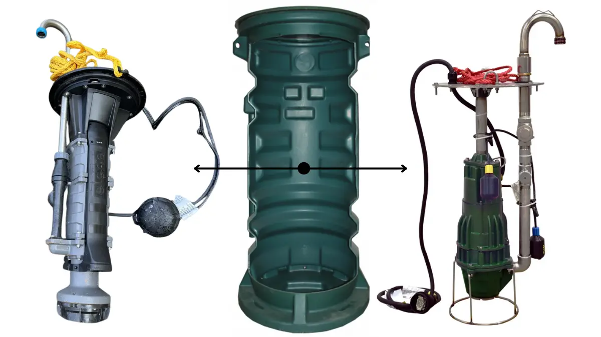
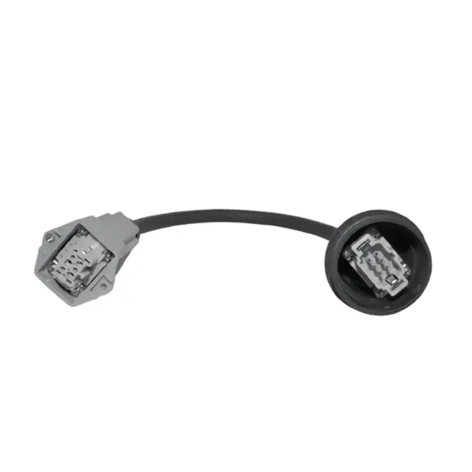
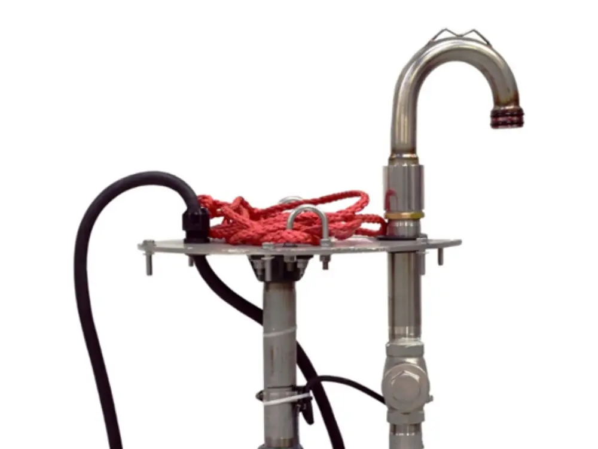

# Reemplazo de Bombas de Cavidad Progresiva E-One: Guía de Ingeniería para el Retrofit de Estaciones de Bombeo a Presión

En el panorama de la ingeniería de fluidos en México, la continuidad operativa de las redes de alcantarillado a presión (LPS, por sus siglas en inglés) se ha visto históricamente comprometida por esquemas de suministro cerrados y restrictivos que vulneran la resiliencia de la infraestructura municipal e industrial. Las infraestructuras críticas que dependen de los sistemas del fabricante extranjero Environment One (E-One) se enfrentan de manera sistemática a un fenómeno de cautividad tecnológica y monopolio de postventa. Al producirse un fallo mecánico o un desgaste en el elastómero de las bombas de cavidad progresiva originales, los gerentes de mantenimiento y directores de infraestructura urbana quedan supeditados a prolongados tiempos de importación de refacciones, costos de servicio técnico centralizados y cotizaciones abusivas que elevan de manera insostenible el Costo Total de Propiedad (TCO) del activo.

Frente a esta problemática, la ingeniería consultiva avanzada plantea el concepto de arquitectura abierta como la única vía tecnológicamente viable para erradicar la dependencia de componentes propietarios extranjeros. No es técnicamente necesario, ni financieramente viable, ejecutar la demolición civil de la estación o sustituir el contenedor enterrado original para solucionar la obsolescencia de la bomba. Mediante un protocolo de acondicionamiento preciso, es factible integrar trenes de descarga y conjuntos trituradores de alta confiabilidad basados en componentes eléctricos industriales estándar y refacciones locales. Este enfoque garantiza la estabilidad operativa del sistema por un ciclo extendido de 15 a 20 años y asegura el suministro inmediato de consumibles en territorio nacional, desbancando sólidamente las propuestas comerciales masivas y de baja durabilidad de los competidores.

---

## Análisis Crítico del Desgaste Mecánico en Cavidades Progresivas

Para proyectar una solución de sustitución verdaderamente definitiva, es indispensable analizar las patologías hidráulicas y tribológicas que inhabilitan las unidades de bombeo de la competencia. Las bombas de cavidad progresiva basan su principio volumétrico en el ajuste interferente entre un rotor helicoidal metálico y un estator elastomérico de goma. Si bien este diseño entrega un flujo constante ante contrapresiones severas, exhibe una vulnerabilidad crítica ante la marcha en seco y la fricción por partículas abrasivas densas presentes en los efluentes municipales de México, tales como arenas de arrastre, gravas finas o lodos pesados con alta concentración de sólidos.

Cuando la velocidad de rotación se mantiene fija sin una disipación térmica adecuada, el estator experimenta un fenómeno de histéresis térmica, lo que degrada aceleradamente el compuesto de Buna-N y destruye la hermeticidad de las cavidades selladas. Este fallo reduce drásticamente la presión máxima a válvula cerrada (*Shut-off Head*), provocando que la bomba gire continuamente sin lograr vencer la contrapresión de la red troncal interconectada, lo que eleva el consumo energético y acelera el colapso del motor sumergible.

La alternativa de ingeniería de Zoeller introduce bombas trituradoras de desplazamiento positivo optimizadas con una metalurgia superior y válvulas de alivio integradas de fábrica que disipan sobrepresiones antes de fatigar los componentes elastoméricos, alineándose rigurosamente con los criterios de diseño hidráulico e ingeniería de materiales de las normas ISO 9906 e ISO 5199, detallados en la siguiente matriz de parámetros constructivos estandarizados:

| Parámetro Técnico / Variable de Ingeniería | Configuración de Motor 1.0 HP | Configuración de Motor 2.0 HP |
| :--- | :--- | :--- |
| **Tipo de Desplazamiento Hidráulico** | Desplazamiento Positivo / Cavidad Progresiva | Desplazamiento Positivo / Cavidad Progresiva |
| **Velocidad de Rotación Operativa (RPM)** | 1,750 RPM | 1,750 RPM |
| **Diámetro de Descarga Nominal (Horizontal)** | 1-1/4" NPT (31.75 mm) | 1-1/4" NPT (31.75 mm) |
| **Carga Dinámica Total Máxima (Shut-off Head)** | 45 metros de columna de agua (64 PSI) | 73 metros de columna de agua (104 PSI) |
| **Material de Construcción del Cuerpo Voluta** | Hierro Fundido Clase 25 (Disipación Térmica Avanzada) | Hierro Fundido Clase 25 (Disipación Térmica Avanzada) |
| **Geometría y Material del Elemento Impulsor** | Rotor Hidráulico Cónico de Acero Inoxidable AISI 316 | Rotor Hidráulico Cónico de Acero Inoxidable AISI 316 |
| **Material del Elemento Elastómero Estator** | Goma de Ingeniería de Alta Compresión (Buna-N) | Goma de Ingeniería de Alta Compresión (Buna-N) |
| **Dureza del Sistema Cortador / Triturador** | Navaja de Acero Inoxidable (Rockwell 55-60) | Navaja de Acero Inoxidable (Rockwell 55-60) |
| **Mecanismo de Protección Hidráulica Integrado** | Válvula de alivio contra sobrepresión y sobrecalentamiento | Válvula de alivio contra sobrepresión y sobrecalentamiento |
| **Dimensiones del Gabinete de Control de Campo** | 1400 x 1000 x 300 mm (NEMA 4X / IP66) | 1400 x 1000 x 300 mm (NEMA 4X / IP66) |
| **Protocolo de Instrumentación y Control** | Sensores Térmicos de Devanado / Transductor de Presión | Sensores Térmicos de Devanado / Transductor de Presión |

---

## Protocolo de Interconexión Eléctrica y Compatibilidad Multipín

El principal obstáculo diseñado intencionadamente por el fabricante para impedir el refaccionamiento libre y cautivar al usuario final es el cableado de alimentación y control de señal. Las estaciones cerradas emplean acoplamientos herméticos con distribuciones de pines exclusivas que inutilizan las conexiones directas de bombas estándar, forzando la contratación de servicios de diagnóstico propietarios de alto costo.

La solución de ingeniería para consumar el exitoso **reemplazo de bombas de cavidad progresiva e-one** exige la adopción de un conector con especificaciones de hermeticidad total bajo grado de protección IP68 según IEC 60529, asegurando compatibilidad directa con las interfaces preexistentes en los paneles de control de tipo redondo o rectangular. El **conector scud de 6 pines para bomba trituradora** cumple rigurosamente con este requerimiento técnico, permitiendo una transición limpia de tipo *plug-and-play* que unifica las líneas de potencia monofásicas y los hilos de señal de los interruptores de nivel variables (flotadores de nivel alto, marcha y parada) sin alterar la lógica de control nativa del sistema.

Al integrar este conector industrial de alta resistencia a la inmersión continua y a los agentes químicos agresivos, se preservan intactas las funciones lógicas de alarma y protección del tablero original del cliente. El proceso de acoplamiento se ejecuta de acuerdo con la siguiente secuencia procedimental:

- Desenergizar el sistema principal desde el interruptor termomagnético general del panel de control para garantizar condiciones de trabajo seguras.
- Extraer el ensamble de la bomba dañada utilizando los cables de izaje de acero inoxidable, evitando traccionar el cable de alimentación eléctrica.
- Desconectar el acoplamiento multipín propietario de la marca extranjera expuesto en el soporte superior del cárcamo.
- Realizar el alineamiento geométrico de las guías de polarización del conector SCUD de 6 pines frente al receptáculo del panel de control.
- Ajustar la tuerca de acoplamiento roscada del conector hasta asegurar la compresión uniforme del empaque de neopreno elastomérico.
- Verificar la resistencia de aislamiento dieléctrico mediante un megóhmetro antes de proceder al descenso y energización de la nueva unidad trituradora de arquitectura abierta.

Esta metodología estandarizada elimina definitivamente los empalmes artesanales con cinta vulcanizada que degradan irreversiblemente el aislamiento dieléctrico del cableado y provocan disparos falsos por fallas de aislamiento a tierra en entornos saturados de humedad y gases conductivos.

---

## Configuración Mecánica del Conjunto de Descarga Tipo Bastón

Una vez resuelta la compatibilidad eléctrica, la reconexión hidráulica en el interior del cárcamo rotomoldeado demanda la sustitución de la tubería de descarga flexible original, la cual suele presentar fatiga por presión, deformaciones plásticas por temperatura y cuellos de botella geométricos que restringen el caudal de desalojo. El ensamble de reemplazo desarrollado por Zoeller incorpora una tubería de descarga rígida con geometría tipo bastón (cuello de ganso), fabricada íntegramente en acero inoxidable AISI 304 o AISI 316. Esta aleación proporciona una inmunidad absoluta ante los agentes químicos corrosivos y el ataque severo por gas sulfhídrico ($H_2S$) derivado de las condiciones de anaerobiosis en aguas negras estancadas, evitando la falla por picaduras (*pitting*) que inutiliza las descargas metálicas de baja especificación.

El diseño tipo bastón se alinea milimétricamente con el sistema de acoplamiento rápido o la válvula de retención integrada en las paredes de los **carcamos prefabricados de polietileno para aguas negras**. La rígidez estructural del conjunto absorbe eficientemente el par de torsión dinámico generado durante el arranque del motor de la bomba trituradora, impidiendo de forma categórica que el equipo golpee las paredes internas del tanque y desplace los flotadores de nivel de su rango geométrico calibrado. Esta disposición simplifica drásticamente las maniobras de izaje e inspección futura a través del sistema de rieles de tubos guía, permitiendo que un solo técnico de mantenimiento extraiga la unidad trituradora desde la superficie sin necesidad de descender al espacio confinado del cárcamo húmedo, disminuyendo los riesgos de trabajo según los estándares de seguridad industrial vigentes en México.

